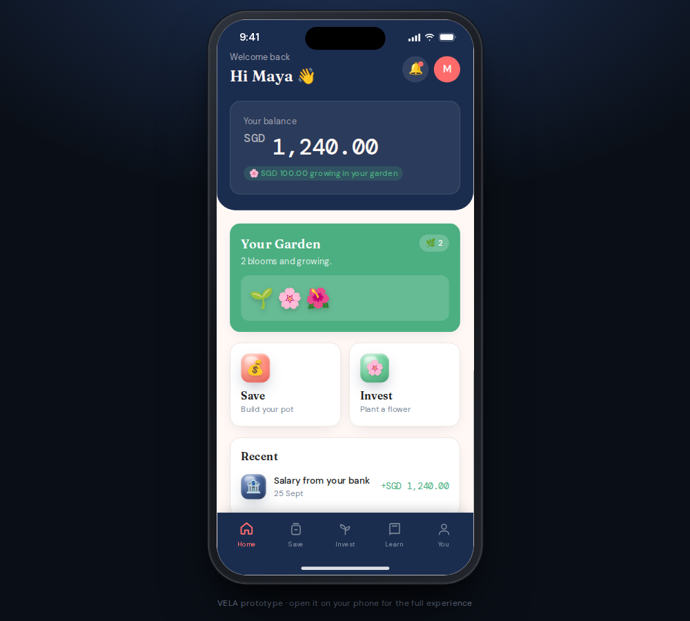

# VELA

*Your money, moving.*

A mobile-web banking and investing prototype for young people getting their first salary.
It is built to be opened on a phone (375px / iPhone viewport) and shared as a single link.

**Live demo: https://amirthanvenkat.github.io/vela-v1/**

Open that link on your phone for the intended experience. VELA is an installable web app: choose
**Add to Home Screen** (Safari's Share menu on iPhone) or **Install app** (Chrome on Android and
desktop), and it launches full screen from its own icon. After the first visit it also works
offline.
On a laptop or desktop it opens inside an iPhone-style frame:



| Home | First investment | Your garden |
|---|---|---|
|  |  |  |

Want to see how it feels to use? Read [Maya's user story](docs/user-story-maya.md), a
screen-by-screen walkthrough from the point of view of a first-salary user.

## Running it locally

You need Node.js 20 or newer.

```bash
npm install
npm run dev        # http://localhost:5777/ with hot reload
```

On a desktop browser (at least 600px wide and 640px tall) the app renders inside an iPhone-style
frame with a Dynamic Island, status bar and home indicator. The frame scales down to fit shorter
windows, and the screen inside always stays at 390x844, so layouts never reflow. On a phone it
fills the screen. Add `?frame=0` (or `&frame=0` in a demo link) to turn the frame off, or
`frame=1` to force it on.

| Command | What it does |
|---|---|
| `npm run dev` | Start the dev server |
| `npm run build` | Build the static site into `dist/` |
| `npm run preview` | Serve the built `dist/` locally |
| `npm run lint` | ESLint |
| `npm test` | Unit tests (Vitest) for the formatting and deep-link helpers |
| `npm run e2e` | End-to-end tests (Playwright) against the production build |
| `npm run icons` | Re-render the PNG app icons from `public/icon.svg` |

The first time you run the end-to-end tests, install the browser with
`npx playwright install chromium`.

## Deploying

Every push to `main` runs [`.github/workflows/deploy.yml`](.github/workflows/deploy.yml): lint,
unit tests, end-to-end tests, build, then deploy `dist/` to GitHub Pages. Pull requests run the
same checks without deploying.

One-time setup: in the repository's **Settings > Pages**, set **Source** to **GitHub Actions**.

The build uses a relative base path, so `dist/` also works from any static host or sub-folder.

## What's inside

A [Vite](https://vite.dev/) + React 18 app:

- React 18, Framer Motion 11 and Tailwind CSS 3, installed from npm and bundled by Vite
- Google Fonts: Fraunces for headlines, DM Sans for the interface, DM Mono for numbers

```
src/
  main.jsx            entry point
  App.jsx             app state, routes and screen transitions
  data.js             risk styles, Learn articles, themes
  routes.js           URL for each screen, and which tab it belongs to
  context.js          app context (useApp)
  lib/                formatting and deep-link/boot helpers (with unit tests)
  components/         UI primitives, garden, bottom nav, overlays, phone frame
  screens/            Onboarding, Home, Save, Invest, Learn, Settings
e2e/                  Playwright end-to-end tests
```

### Flows

1. Onboarding: Splash (auto-advances), Welcome, "What's your vibe" risk choice (🐢 / 🦊 / 🚀), Name, Garden intro
2. Home: greeting, balance card, garden tile, quick actions, and a 5-tab bottom navigation bar
3. Home extras: a "Recent" activity list and a notifications sheet behind the bell (with an unread dot)
4. Save: savings pot, set or edit a goal (name + target, with a progress bar), add money with preset chips, then a confirmation screen
5. Invest: garden, choose an amount (SGD 20 / 50 / 100 or your own, minimum SGD 10), then a "First bloom" moment where the garden springs up, a flower opens, and coral and leaf confetti falls
6. Learn: three jargon-free explainer cards that open a simple article reader
7. Settings: Light, Dark, and Moss themes, edit name, retake the risk choice, an About section, and Reset demo

Saving and investing can't take more than your balance; the screen explains why the button is
disabled instead of letting the balance go negative.

### Demo state

Maya, SGD 1,240.00 balance, Fox (Balanced) risk choice, a one-seed garden, and SGD 320 in the Savings Pot.

Your progress is saved in the browser (`localStorage`), so a refresh keeps your name, balance,
garden, goal and theme, and returns you to the tab you were on. **You > Reset demo** clears it
and starts again from the splash screen. The browser back button (and Android back gesture) moves
between screens inside the app.

## Design notes

- Routing uses [React Router](https://reactrouter.com/) 7 with hash URLs, so every screen has an
  address that works on GitHub Pages and survives a refresh: `#/home`, `#/save/add`,
  `#/save/goal`, `#/invest/plant`, `#/learn/risk`, `#/settings/style` and so on (the full table is
  `SCREEN_PATHS` in `src/routes.js`). Framer Motion's `AnimatePresence` slides screens left or
  right; Back and Forward use the router's history position to pick the direction. Returning users
  skip onboarding, and a screen opened directly still has a working Back button (it goes up to
  its tab).
- Installable and offline: [`vite-plugin-pwa`](https://vite-pwa-org.netlify.app/) generates the web
  app manifest and a service worker that precaches the whole build, so after the first visit
  VELA opens with no connection (Google Fonts are cached as they load). A new version downloads
  in the background and is used from the next launch; nothing reloads while you're mid-flow.
  The icon is `public/icon.svg` (full-bleed, so it also works as a maskable Android icon).
- Themes are driven by CSS variables, so every screen restyles instantly.
- The "3D glass" icons are approximated with glossy gradient bubbles wrapping an emoji.
- The bottom navigation has 5 line icons (Home, Save, Invest, Learn, You), with "You" opening Settings.
- Tappable cards work with the keyboard (Tab, then Enter or Space), and animations follow the
  system "reduce motion" setting (no confetti or slides when it is on).
- The copy avoids financial jargon. Where a term is needed, it is followed by a plain-language line.
- Demo links open any screen with seeded demo state, which is how the docs screenshots are
  captured: add `?demo` to a route, plus any of `name`, `flowers`, `amt`, `goal`, `theme`, `risk`
  and `frame`. For example `#/home?demo`, `#/invest/done?demo&flowers=1&amt=50`,
  `#/save?demo&goal=Trip%20to%20Japan:1000`, or `#/settings?demo&theme=dark&frame=0`.
  Demo links always start from the demo state: they don't read or overwrite saved progress.
  Older links in the `#screen=investSuccess&flowers=1` form still work; they are rewritten to the
  route form on load.
