# User story: Maya's first month with Vela

This document walks through the app from the point of view of one sample persona. Every
screenshot is a real capture of the prototype at phone size.

## The persona

**Maya, 23, Singapore.** She started her first full-time job three months ago and earns a
junior salary. She has a bank account, a debit card, and about SGD 1,240 that survives to
the end of each month. Her parents never talked about investing, and the finance apps she
has tried felt like they were built for traders. Words like "portfolio rebalancing" made
her close the app.

What Maya wants is simple: put a little money aside, let some of it grow, and understand
what is happening without needing a dictionary.

---

## Story 1: Starting without fear

*As Maya, I want the app to greet me in plain language, so that I don't feel like I need
financial knowledge just to sign up.*

Maya opens the link a friend sent her. After a short splash screen she lands on a welcome
page that says "Investing without the headache." No forms, no ID numbers, one button.

She taps **Get Started** and gets a single question about how she feels about money, with
three characters to choose from: a tortoise that plays it safe, a fox that stays balanced,
and a rocket that goes bold. There is no quiz and no scoring. She picks the fox because it
feels like her, and the card lights up in coral to confirm the choice.

| Welcome | Choosing her style |
|---|---|
| 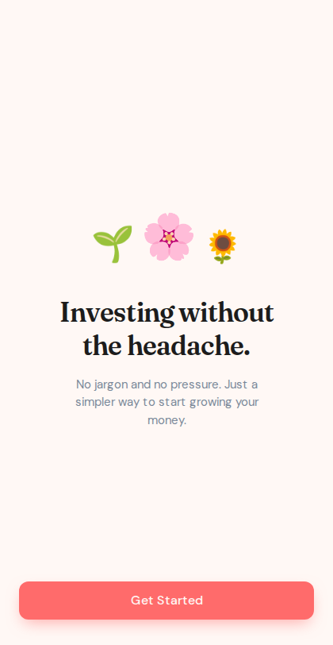 | 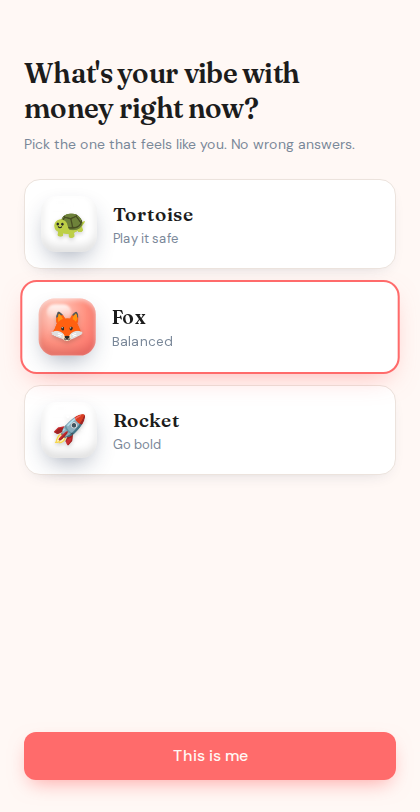 |

**Why this matters:** the risk question is the only onboarding hurdle, it uses characters
instead of financial terms, and there is no wrong answer. Buttons are at thumb height and
at least 48px tall.

---

## Story 2: Meeting the garden

*As Maya, I want a picture of my progress instead of charts, so that investing feels like
something growing rather than something to monitor.*

After telling the app her name, Maya meets her garden: a green screen with a single seed.
The app explains the one metaphor it will use everywhere: every time she invests, she plants
a new flower, and over a few days it grows from a seedling into a bloom.

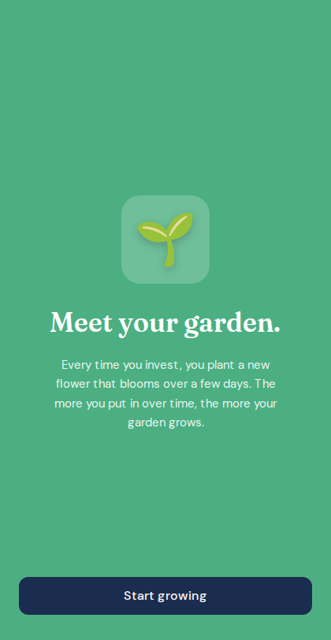

**Why this matters:** the garden gives Maya a mental model that rewards the habit (planting
regularly) rather than the market's mood. The copy says her garden grows with what she puts
in over time.

---

## Story 3: Checking her money at a glance

*As Maya, I want one screen that shows my balance and what I can do next, so that a quick
check takes seconds.*

Home shows her balance in large clear digits, a green line showing how much is growing in her
garden, and her garden tile with the seed waiting. Below that sit Save and Invest cards, a short
list of recent activity, and Learn. The bottom bar keeps the same four destinations plus her
profile everywhere in the app. The bell opens a sheet with everything that has happened since
she last looked.

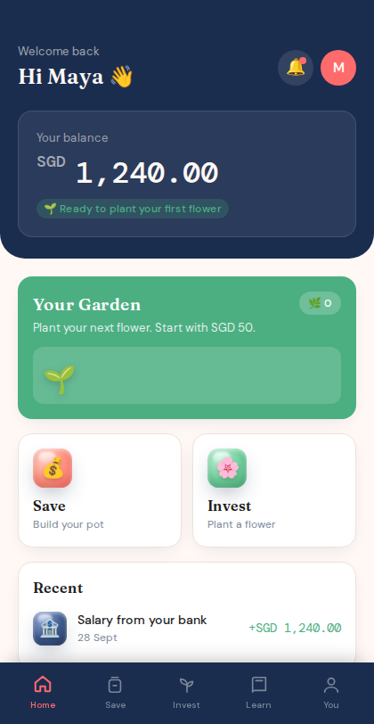

| Notifications |
|---|
| 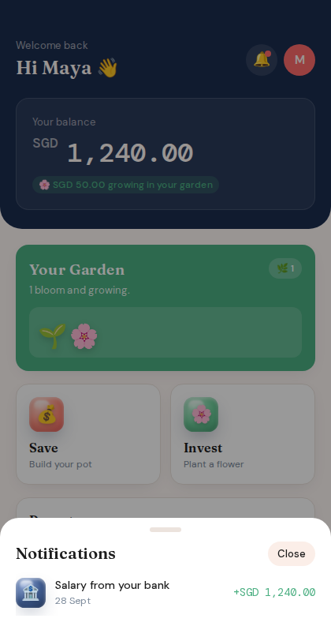 |

**Why this matters:** one glance answers "how much do I have" and "what can I do", and the
garden keeps her goal visible without a single chart.

---

## Story 4: Saving a little every payday

*As Maya, I want to move a small amount into savings in a few taps, so that saving becomes
a habit rather than a decision.*

Payday. Maya opens Save, taps **Add Money**, and hits the SGD 50 preset chip rather than
typing. One tap on **Save now** and a green confirmation tells her "SGD 50.00 saved. Every
bit counts." Her balance updates straight away.

| Entering an amount | Confirmation |
|---|---|
| 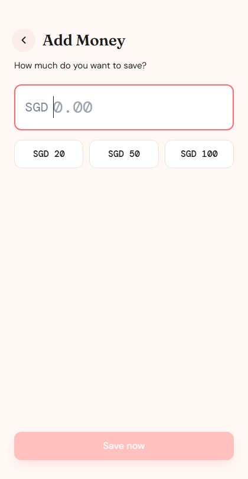 | 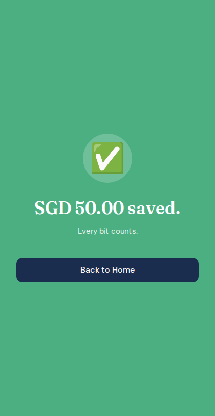 |

A few weeks later she taps **Set a Goal**, types "Trip to Japan" and picks the SGD 1,000 chip.
The savings pot now says what it is for, with a coral bar showing how far along she is.

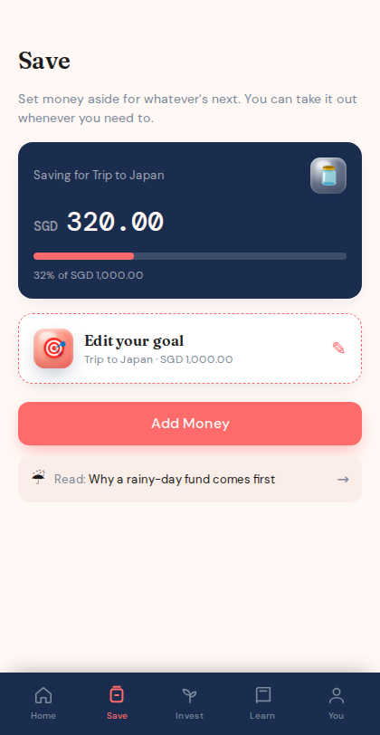

**Why this matters:** preset chips remove the "how much is right?" hesitation, and the
confirmation celebrates a small amount instead of nudging her to save more. If she types more
than she has, the button stays disabled and a line tells her how much is available, so her
balance can never go negative. A named goal turns "saving" into "saving for something".

---

## Story 5: Her first investment

*As Maya, I want to invest a small amount and be reassured I can get it back, so that the
first step doesn't feel like a commitment I might regret.*

Maya has read that starting small is fine, so she taps **Plant a flower**. SGD 50 is already
picked, with SGD 20 and SGD 100 one tap away (the smallest flower is SGD 10). The screen shows
exactly what is happening: the amount, her fox style, how much she has available, and one line
that answers her biggest worry: she can take her money out whenever she wants.

She taps **Invest SGD 50.00**. The screen goes dark, her garden rises from the bottom, and a
seedling marked "Just planted" pops up next to her seed with a burst of confetti. "Your first
flower is planted."

Over the next three days she checks in and watches it grow: a seedling, then a sprout, then a
bud, then a full bloom. The Invest screen tells her when the next bloom is due.

**Why the garden grows by days, not by market prices:** the flowers reward the habit of planting,
not the market's mood, so a bad week never wilts her garden and there's nothing to refresh.

| Confirming | First flower planted |
|---|---|
| 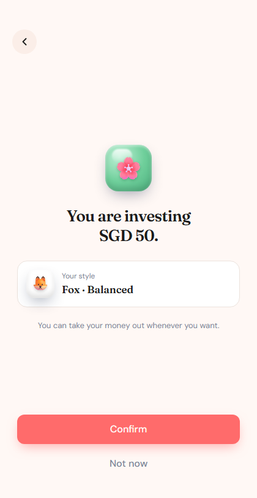 | 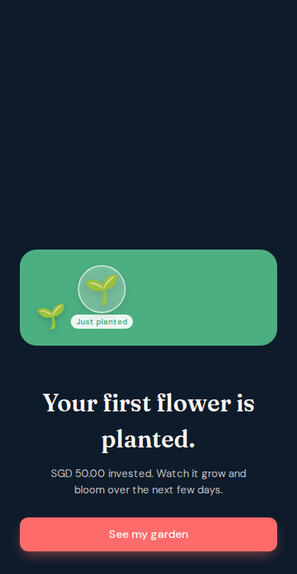 |

**Why this matters:** the moment of highest anxiety (committing money) pairs the exact
amount with a plain-language exit promise, and the reward moment is designed to be worth
coming back for.

---

## Story 6: Learning at her own pace, making it hers

*As Maya, I want short explanations in normal words, so that I understand what I own
without studying.*

Waiting for the bus, Maya opens Learn and reads "What is investing?". Four short
paragraphs, no jargon, one idea per paragraph. Later she pokes around Settings, switches
the theme to Dark for night reading, and sees her fox profile with the option to retake
the question whenever her comfort changes.

Learn has six short reads. Three of them show up right where Maya needs them: under her
Savings Pot she finds "Why a rainy-day fund comes first", and under her garden, "Dips are
normal". "Small amounts grow" shows her, with an example, why starting with SGD 50 at 23 beats
waiting until she earns more.

| A short read | Settings and themes |
|---|---|
| 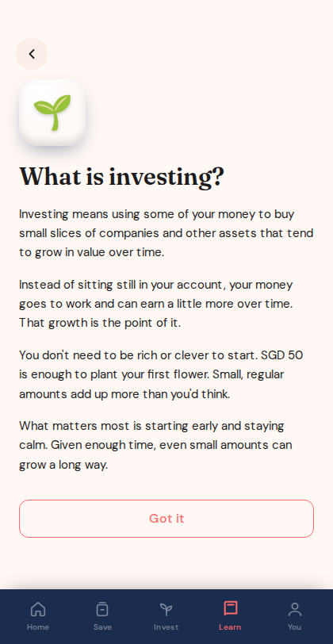 | 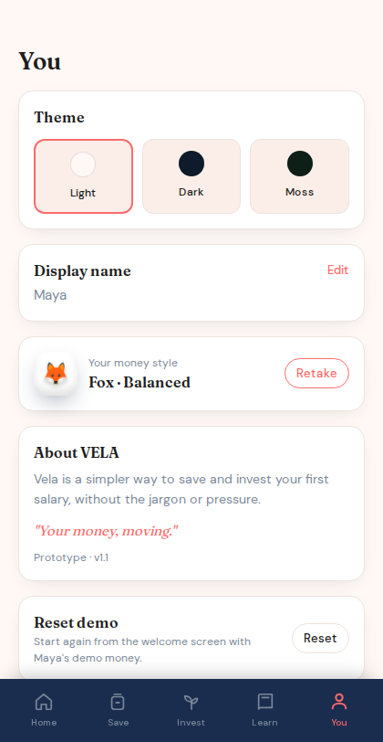 |

**Why this matters:** education lives inside the app in three-minute pieces, and the risk
profile is a preference she can change, not a label she is stuck with.

---

## Where Maya ends up

A month in, Maya has SGD 370 in her savings pot, a goal she can see filling up, two flowers in her garden, and she can
explain to a colleague what diversifying means without using the word. The app never asked
her to be someone she isn't. That is the product goal in one sentence.

*All data in the prototype is mocked. Maya is a design persona, not a real user. Screenshots
are captured frameless at phone size with demo links such as `#/home?demo&frame=0`.*
